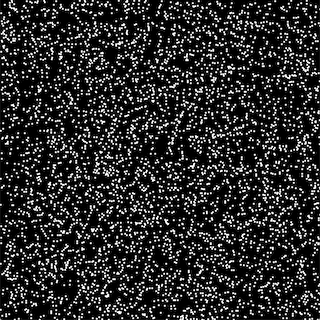
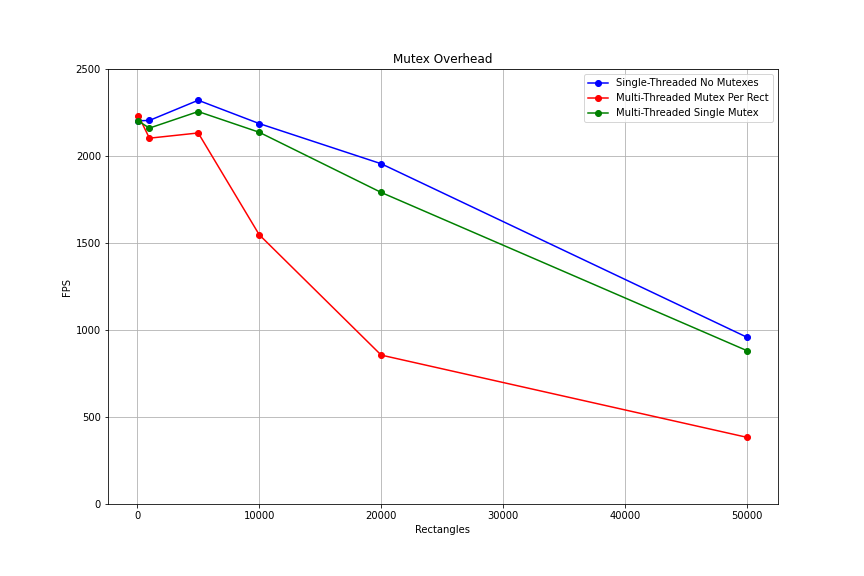

# Overview

This repository contains a simple C++ SDL2 application for gauging the overhead of multi-threading
with mutexes.

What is the frame-rate penalty incurred by moving model updates out of the main render thread and into an 
update thread where model reads and writes are mutex-protected?

This particular experiment is set up to surface the costs associated with multi-threading in this manner 
and doesn't highlight the benefits or motivations for such a design. The model updates performed in the
tests are rectangle (x, y) position increments. Just enough to display an animation but not enough
to register on the performance scale.

# Methodology

The benchmark application animates particles streaming across the display window. 
A particle is a small pixelated rectangle. Particles are updated at a fixed target rate.



The application can be broken into several parts: 

* Model update
  * Particle positions are incremented
* Model read
  * Particle positions are read by render thread
* Model render
  * Particles are rendered with `SDL_RenderFillRects`

There are three test modes:

* Single-thread no mutexes
  * Updates happen inline, based on observed time deltas
* Multi-threaded mutex per particle
  * Updates happen in dedicated update threads
  * Each particle position is _updated_ within a granular mutex section by the update thread
  * Each particle position is _read_ within a granular mutex section by the render thread
* Multi-threaded single mutex
  * Updates happen in dedicated update threads
  * All particle position are _updated_ within a single broad mutex section by the update thread
  * All particle positions are _read_ within a single broad mutex section by the render thread

# Build

On a Unix-like system:

```
cmake .
make
./benchmark
```

# Results

The results below were gathered on the following machine:

* MacBook Pro
* macOS Catalina 10.15.7
* 2.4 GHz 8-Core Intel Core i9 processor
* 32 GB 2667 MHz DDR4

Test parameters:

* Window size: 640 x 640
* Individual test run time: 5 seconds
* Target update rate: 200 updates per second
* Particle size: 3 x 3
* Test runs per parameter group: 4
* Particle counts: 100, 1,000, 5,000, 10,000, 20,000, 50,000

Of the _N_ runs per parameter group, the lowest FPS result is discarded and the remaining _N - 1_ 
FPS results are averaged.

|Test|100|1,000|5,000|10,000|20,000|50,000|
|------|---|-----|-----|------|------|------|
|Single-Threaded No Mutexes|2203|2205|2321|2187|1956|958|
|Multi-Threaded Mutex Per Rect|2232|2103|2133|1548|856|383|
|Multi-Threaded Single Mutex|2201|2161|2256|2137|1791|881|



# Conclusion

* Below a threshold (roughly 5,000 particles in the tests conducted) overhead is minimal and performance is comparable across all test modes.
* At scale, the overhead of a granular mutex per particle is considerable.
* The overhead of a single mutex is quite small, though still measurable.